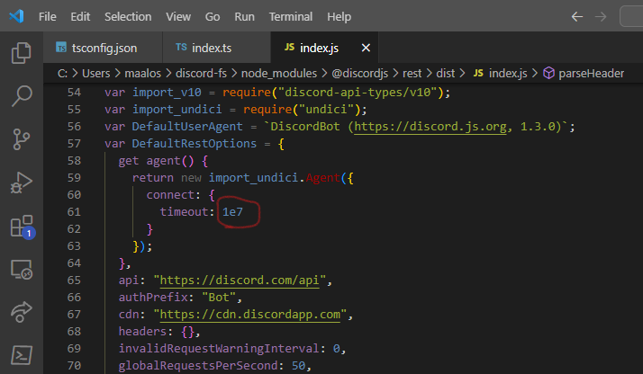

# discord-fs

discord-fs is a Discord bot that allows creating an encrypted virtual file system accesible via FTP, backed by text-messages for journaling and attachments for storage. The maximum file size limit is 25MB. For bigger files i've implemented multi-part up & download. There is no limit in the amount of files in theory. 

## Features
* Theoretically unlimited file size thanks to splitting the file in 25MB chunks (discord is quite unreliable when it comes to uploading 20 files in a row without any issues)
* FTP frontend
* HTTP frontend (up & downloading) 
* (Incomplete, disabled by default) FUSE frontend
* optional AES-256-CBC encryption (with per file iv, unreadable journal)

## Installation & Preparation

If you haven't already created a discord bot, follow the following steps:

### Create a Discord bot identity
1. Create a new application on https://discord.com/developers/applications
2. Select your new app, navigate to "Bot" in the sidebar, "Add Bot", copy its Token
3. Navigate to "OAuth2" in the sidebar, write down your "Client ID" 
4. Fill in http://localhost as Redirect above "Add Redirect" and save the form

### Invite the Discord bot to your guild
4. Complete the following url with your client id:
    https://discord.com/oauth2/authorize?response_type=code&client_id=YOUR_CLIENT_ID_HERE&scope=bot
5. Navigate to the url and let the bot join your preferred guild

You can obtain your guild and channel snowflake (its id) by enabling developer mode on your Discord client  (User Settings > Advanced > Developer Mode)
and rightclicking both the guilds name or the specifc channel and choose "Copy ID" from the context menu.

## Quick Start

You can clone or fork this repo and start from there (recommended if you want to make changes).
```
git clone https://github.com/maalos/discord-fs.git
cd discord-fs
npm i
cp .env.example .env
```

then adjust the values inside `.env`, after that run the code with `npm start`.

or directly download and launch the bot as-is from GitHub using npx. 

```powershell
#EXAMPLE for PowerShell
$ENV:GUILD="123412341234123412" #The guild snowflake
$ENV:CHANNEL="123412341234123412" #The channel snowflake
$ENV:TOKEN="tokendupadupa123123" #Your discord bot api token
$ENV:AES_KEY="its a secret" #If you don't want encrpytion, keep this empty, otherwise roll a new secret

$ENV:LISTEN_IP="127.0.0.1" #IP the FTP server will listen on
$ENV:EXTERNAL_IP="127.0.0.1" #IP reported to passive FTP connections (Set it to your external ip)
$ENV:FTP_PORT="2121" #Port the FTP server will listen on
$ENV:HTTP_PORT="8080" #Port the web frontend will listen on

npx git+https://github.com/maalos/discord-fs
```

## Weird errors
Errors such as the one below are related to timeouts. Edit the file on the screenshot below - change 3e4 (30 seconds) to a high value like 30e7 (30000000 ms) so it doesn't occur ever again. Or get better internet.
```
/root/.npm/_npx/e50a84c8e0bdb063/node_modules/undici/lib/client.js:1388
      errorRequest(client, request, err || new RequestAbortedError())
                                           ^
RequestAbortedError [AbortError]: Request aborted
    at RequestHandler.abort (/root/.npm/_npx/e50a84c8e0bdb063/node_modules/undici/lib/client.js:1388:44)
    at abort (/root/.npm/_npx/e50a84c8e0bdb063/node_modules/undici/lib/api/abort-signal.js:8:10)
    at AbortSignal.self.<computed> (/root/.npm/_npx/e50a84c8e0bdb063/node_modules/undici/lib/api/abort-signal.js:29:5)
    at AbortSignal.[nodejs.internal.kHybridDispatch] (node:internal/event_target:736:20)
    at AbortSignal.dispatchEvent (node:internal/event_target:678:26)
    at abortSignal (node:internal/abort_controller:292:10)
    at AbortController.abort (node:internal/abort_controller:323:5)
    at Timeout.<anonymous> (/root/.npm/_npx/e50a84c8e0bdb063/node_modules/@discordjs/rest/src/lib/handlers/Shared.ts:68:46)
    at listOnTimeout (node:internal/timers:559:17)
    at processTimers (node:internal/timers:502:7) {
  code: 'UND_ERR_ABORTED'
}
```


## Contributing
At this point discord-fs is pretty mutch just a POC.
Pull requests are welcome. 

## License
[MIT](https://choosealicense.com/licenses/mit/)
